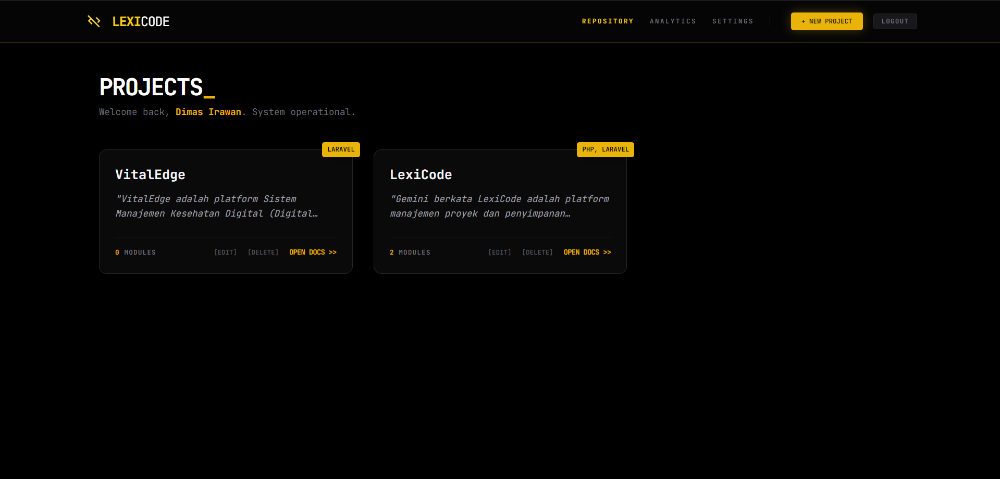

<p align="center">
  
</p>

<h1 align="center">⚡ LEXICODE</h1>

<p align="center">
  <strong>The Cutting-Edge Code Vault for Modern Developers.</strong><br>
  Built with Laravel, Tailwind CSS, and Alpine.js.
</p>

<p align="center">
  
  
  
  
</p>

---

## 🖥️ System Preview

Lacak dan simpan snippet kode kamu dalam antarmuka yang terinspirasi dari tema Cyberpunk/Terminal.

<p align="center">
  <kbd>
    
  </kbd>
</p>

<br>

<table width="100%">
  <tr>
    <td width="50%">
      <p align="center"><strong>📂 Project Deep Dive</strong></p>
      
    </td>
    <td width="50%">
      <p align="center"><strong>🧩 Module Management</strong></p>
      
    </td>
  </tr>
</table>

---

## 🔥 Key Protocols

- **Cyberpunk UI/UX**: Antarmuka berbasis _dark mode_ dengan font **JetBrains Mono** untuk pengalaman koding yang imersif.
- **Snapshot Engine**: Simpan snippet kode langsung menjadi gambar PNG estetik melalui fitur "Export PNG".
- **Rapid Search (Ctrl+K)**: Temukan modul atau snippet apapun dalam hitungan detik tanpa menyentuh mouse.
- **Multi-Tech Support**: Klasifikasikan project berdasarkan Tech Stack (Laravel, React, Python, dll).

---

## 🛠️ Deployment Log

Untuk menjalankan repository ini di terminal lokal kamu:

1. **Clone the repository**
    ```bash
    git clone [https://github.com/dimasrwan/LexiCode.git](https://github.com/dimasrwan/LexiCode.git)
    ```
